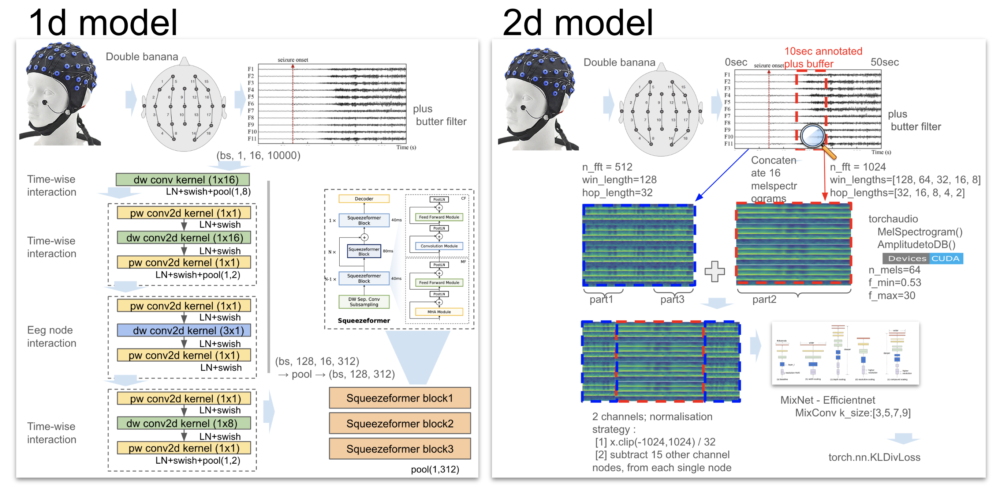

## Harvard Medical School - Harmful Brain Activity Classification 3rd place solution


This repository contains the codebase to reproduce the winning solution to the Harvard Medical School - Harmful Brain Activity Classification competition on kaggle. 

Competiton website: [link](https://www.kaggle.com/competitions/hms-harmful-brain-activity-classification).  
3rd place solution summary: [link](https://www.kaggle.com/competitions/hms-harmful-brain-activity-classification/discussion/492471). 

Our solution is an ensemble of multiple models from two diverse modeling approaches. The first approach is to apply pretrained 2d-CNN architectures to the MelSpectrogram transformation of the data. The second approach uses 1D-Convolutions to encode the raw eeg data before modeling with Squeezeformer blocks.
Key ingredients for our solution were a robust cross validation based on data selection and creative augmentations.



## Environment

Ensure to have a GPU with at least 24GB memory, along with a recent version of pytorch installed. Ideally inside a recent nividia pytorch container from the [ngc catalog](https://catalog.ngc.nvidia.com/orgs/nvidia/containers/pytorch). 
After this, up the environment with, 
```
pip install -r requirements.txt
```

By default training is logged via neptune.ai to a quickstart project. If you want to use your own neptune project set `cfg.neptune_project` in each of the config files (`config/` directory), which have the `cfg.neptune_project` parameter. A blog post discussing how we used neptune for a previous competition can be found [here](https://www.medium.com/@darragh.hanley_94135/mastering-mlops-with-neptune-ai-84e635d36bf2) . 

### Preparation

Down load the competition data using the Kaggle API, and unzip it into the `datamount/` folder.
```
kaggle competitions download -c hms-harmful-brain-activity-classification
```
  
We have provided a train file, `train_folded.csv` which has a column `fold`, which assigns each patient to one of four folds. 
  
From this, create the training sets, using `python scripts/filter_train.py`. 
  
This will output three csv files, in the `datamount/` directory, which will be used in training and validation. 
  
```
train_folded_6k6.csv      # Golden set for validation (5940 rows)
train_folded_6k6c.csv     # Set for training with high vote eegs (6351 rows)
train_folded_6k6_1up.csv  # Larger set for training with high and low vote eegs (20184 rows)
```

### Training

A script to train all the configs is below. This runs through all the training runs needed. We have 10 models to run, and for each model we give 16 training runs - two on each of the four folds, and eight are trained on the full data. 
The script is set up to run in sequence; but there is no dependencies and the training runs can be made in parallel. 

The two best configs are,
- cfg_5a ... Best single 2D model - 4 folds, 2 seed per fold - CV/Public/Private 0.232 / 0.24 / 0.29
- cfg_2a ... Best single 1D model - 4 folds, 2 seed per fold - CV/Public/Private 0.257 / 0.25 / 0.30

To train all in sequence, run,
```
./run_train.sh
```

### Blending

To calculate blend weights, run the below. All the training must be run beforehand. 
```
python scripts/blend_weights.py 
```
This will train a small neural net to calculate blend weights for each config, as well as class bias value which is added to the predictions. The output will be like below,

```
# Model weights
{
  "cfg_2a": 0.12269417,
  "cfg_2b": 0.14088638,
  "cfg_4": 0.10537927,
  "cfg_5a": 0.098695554,
  "cfg_5d": 0.09444124,
  "cfg_5b": 0.15284501,
  "cfg_5c": 0.1097273,
  "cfg_3": 0.11740086,
  "cfg_1": 0.12932082
}
# Class bias term for the 6 classes
[ 0.012535,  0.03458 ,  0.01761 ,  0.05957 , -0.02608 , -0.0982  ]
```


